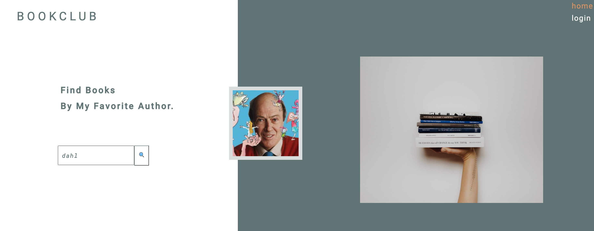
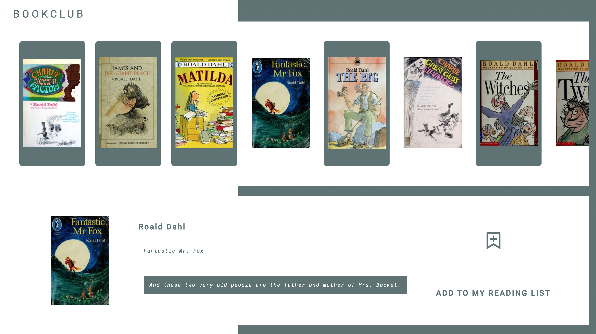
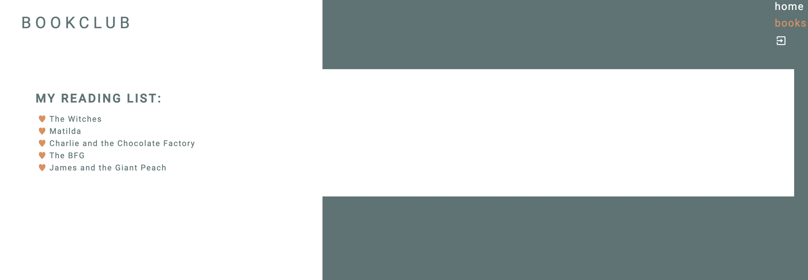

#  BOOKCLUB - HOW TO GET STARTED 

##  INHOUDSOPGAVE 

* Inleiding

* Lijst van benodigdheden

* Installatie handleiding

* Inloggen en registreren

* NPM-commando’s

##  INLEIDING 

In deze READ.me is een beschrijving terug te vinden voor de webapplicatie “BOOKCLUB”. Het doel van deze website is om bij te dragen aan de modernisatie van de huidige boekenwereld. Het creëren van een online landschap voor boekliefhebbers en/of voor de toekomstige boekliefhebber. Met tevens als missie, verschillende doelgroepen aan te spreken, zowel jong als oud. De webapplicatie heeft daarom een modern en hedendaags design zodat het kan meegroeien met de tijd en makkelijk is in gebruik. Hierdoor is de applicatie voor iedereen toegankelijk. Heeft men een favoriete schrijver? Dan kan de gebruiker meer inspiratie opdoen en middels de auteursnaam andere titels opvragen. Daarna kunnen deze titels worden opgeslagen in een persoonlijke boekenlijst, die via een webbrowser overal toegankelijk is.

Het project is opgezet met Create React App.

**User Stories e.g.:**
* As a user I want to see a list of books, so I can be inspired to read more
* As a visually orientated reader I want to see the covers so I can be inspired
* As a user, when I add a book to my reading list, it is saved, so I can use my reading list anywhere
* As a user I want to be able to search by entering a name of an author, so I can find other books written by authors I like

**Home:**

**Register:**

**Boekenlijst:**

##  BENODIGDHEDEN 
* Node.js
* NPM
* Git
* Firebase/ Google account

##  APPLICATIE STARTEN 
* clone Git repository naar jouw locale machine
* `npm install`
* maak een .env bestand aan
* ga naar de firebase website
* log in via jouw firebase account 
* ga naar de console
    * maak een nieuw project aan
    * google analytics: enable
    * klik op 'create project'
    * registreer een nieuwe app
* kopieer de gegeven credentials naar de .env
* ga naar authentication
    * klik op 'get started'
    * klik op 'email/password'
    * klik op 'enable'
* ga naar firestore database
    * klik op 'create database'
    * firestore
    * test mode
    * locatie
    
*  start applicatie in terminal `npm start`
*  open http://localhost:3000 

"**note**: voor de nakijker van Novi Hogeschool is Firebase al klaargezet. De firebase credentials zijn apart meegestuurd en hoeven enkel worden toegevoegd aan een .env bestand **

###  TESTEN 
In de map helpers zijn de unit testen terug te vinden. Deze kunnen worden gerund met de commando `npm test`

##  INLOGGEN/REGISTREREN 

* In deze applicatie wordt gebruik gemaakt van Firebase en word de data opgeslagen in Firestore. Hiervoor zijn geen extra inloggegevens of wachtwoorden voor nodig.  
* Via het registratieformulier kan een niet bestaande gebruiker zich aanmelden. Een account is eenvoudig aangemaakt met een e-mailadres en wachtwoord  
* Nadat de gebruiker zich succesvol heeft geregistreerd, kan er worden ingelogd via het inlogformulier 
* Na het succesvol inloggen wordt de gebruiker direct naar de homepagina doorgelinkt en heeft de gebruiker volledig toegang tot alle functionaliteiten  

##  NPM COMMANDO'S 
* `npm install` - hiermee kunnen de node_modules worden geïnstalleerd
* `npm start` - het project zal opstarten
* `npm test` - de unit testen zullen worden uitgevoerd
* `npm eject` - alle configuratie is zichtbaar en kan worden aangepast

